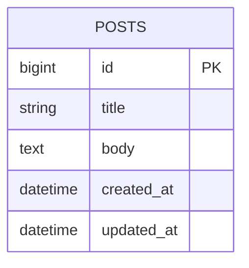
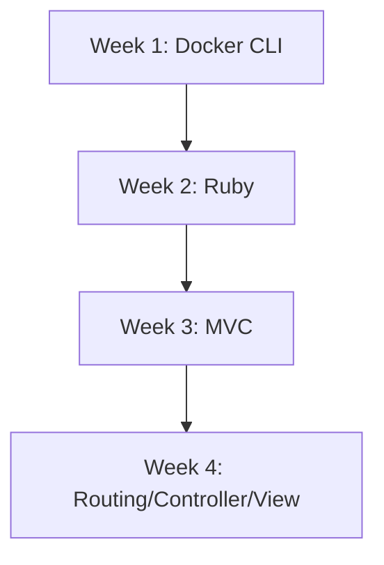

[](https://github.com/masa0917-private/rails-learning-cli-mac/actions/workflows/ci.yml)

# Rails (CLI + Docker Compose) 学習リポジトリ

このリポジトリは「CLI中心・Docker Composeで隔離されたRails学習環境」を目的としたテンプレート／仕様です。

主な目的
- Rails公式ドキュメントを主教材とした学習を行う
- ホスト環境を汚さない（Ruby/Rails/DBはコンテナ内へ）
- VS Code Dev Container に依存しない CLI-first ワークフロー

Prerequisites
- Docker Desktop（macOS/Windows/Linux）
- docker compose（Docker Desktop に同梱）
- サンプルアプリ `blog/`（Rails 7.1 / Ruby 3.3.11 / SQLite）は本リポジトリに同梱済み

リポジトリ構成（例）

```text
~/Documents/Rails/
  └── blog/
      ├── Dockerfile
      ├── Dockerfile.dev
      ├── compose.yaml
      ├── .dockerignore
      ├── Gemfile
      ├── Gemfile.lock
      ├── app/
      ├── bin/
      ├── config/
      ├── db/
      ├── storage/
      ├── test/
      └── tmp/
```

ER図サンプル（Step 5: 単一モデル CRUD）



進捗可視化（Mermaidフロー）



素早い開始（このリポジトリの blog/ を使う）

サンプルアプリ `blog/` は既に含まれています。以下はリポジトリのルートから実行します。

```bash
git clone https://github.com/masa0917-private/rails-learning-cli-mac.git
cd rails-learning-cli-mac
```

compose.yaml と Dockerfile.dev は `blog/` 配下に用意済みです（詳細は Specification.md を参照）。

compose の最小例（参考）

```yaml
services:
  web:
    build:
      context: .
      dockerfile: Dockerfile.dev
    command: ./bin/rails server -b 0.0.0.0 -p 3000
    ports:
      - "3000:3000"
    volumes:
      - .:/rails:delegated
    environment:
      RAILS_ENV: development
    stdin_open: true
    tty: true
```

ビルド・DB準備・起動（ルートから make を実行）

```bash
make build      # docker compose -f blog/compose.yaml build
make db-prepare # rails db:prepare を実行
make up         # docker compose up
```

Makefile の主なターゲット（すべて blog/compose.yaml を対象に動作）

- make build        : docker compose build
- make buildx       : buildx を用いたマルチアーキビルド（Apple Silicon 向け）
- make up           : docker compose up
- make up-detach    : docker compose up -d
- make down         : docker compose down
- make db-prepare   : rails db:prepare を実行
- make console      : rails console を起動
- make test         : rails test を実行
- make shell        : web コンテナで bash を起動
- make logs         : コンテナのログを表示
- make help         : ヘルプを表示

Apple Silicon (M1/M2) 注意点
- イメージが amd64 を前提にしている場合、`docker buildx` または Compose の `platform: linux/arm64` 指定が必要になることがある
- ネイティブ gem（nokogiri, sqlite3 等）は追加の dev パッケージが必要（Specification.md に詳細あり）
- Docker Desktop の推奨設定: CPUs 4+, Memory 8GB+, gRPC FUSE が利用可能なら検討

参照: Specification.md を必ず先に読み、手順に従ってください。

Specification（詳細仕様）:
- 詳細かつ公式準拠の手順、Dockerfile.dev、compose 例、ER図、Mermaid 図は Specification.md にまとめています。
- ローカルで開く: `less Specification.md` または `cat Specification.md`

---

(この README は Specification.md の要旨とサンプルを含みます。実運用では Specification.md が正本です。)

---

学習開始手順（このリポジトリを利用する場合）

サンプルアプリ `blog/`（Rails 7.1 / Ruby 3.3.11 / SQLite）は既にこのリポジトリに含まれています。新規に生成する必要はありません。

1. このリポジトリをクローンまたは最新に pull する
2. make build  (または make buildx)
3. make db-prepare
4. make up   → http://localhost:3000 を開く

補足: Makefile は `blog/compose.yaml` を対象に動作します（`docker compose -f blog/compose.yaml ...`）。リポジトリのルートから `make` を実行してください。

CI の期待値と解釈

- このリポジトリの CI は .github/workflows/ci.yml に定義されています。`blog/` を作業ディレクトリとして、Ruby 3.3.11 + SQLite でテストを実行します。
- サンプルアプリ `blog/` が含まれているため、CI は実際に `rails db:prepare` と `rails test` を実行します。
- CI バッジ（README 上部）で成功/失敗を確認してください。失敗時は Actions のランログを開き、最初に失敗したステップの標準出力を確認します。

Start here — Rails チュートリアルの開始点

- 公式チュートリアル（Getting Started）を最初に行ってください: https://guides.rubyonrails.org/getting_started.html
- 推奨フロー: Specification.md を読み、リポジトリ内の `blog/` を使ってローカルで手を動かしながら進めると良いです。
- 週次チェック: CI は週次で自動実行されます（Schedule: Sunday 00:00 UTC）。ローカル変更は push して CI をトリガーしてください。

トラブルシュート（よくある問題）

- "Could not locate Gemfile": カレントディレクトリが app のルートであることを確認（docker compose run は blog 配下で実行）
- ネイティブ gem ビルドエラー: Dockerfile.dev に libxml2-dev, libxslt1-dev, zlib1g-dev, build-essential を追加して再ビルド
- Apple Silicon (M1/M2) のアーキ違い: make buildx を使う、または compose で platform: linux/arm64 を指定
- bind mount が遅い(macOS): volumes に ":delegated" を付ける、Docker Desktop の gRPC FUSE を検討

補足: Specification.md が正本です。README はクイックスタートと要点をまとめたものです。

参考: Specification.md を先に読み、手順に従ってください。