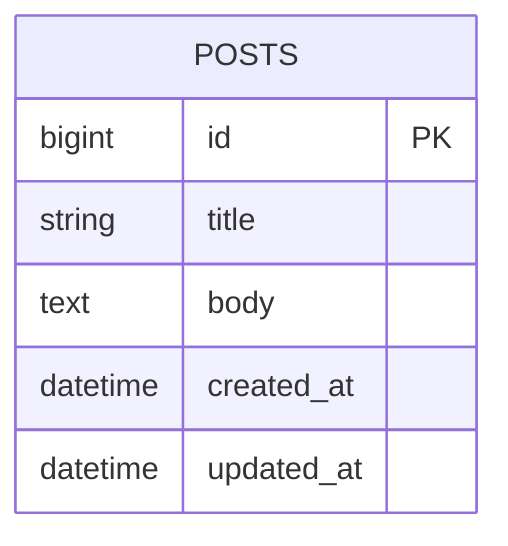
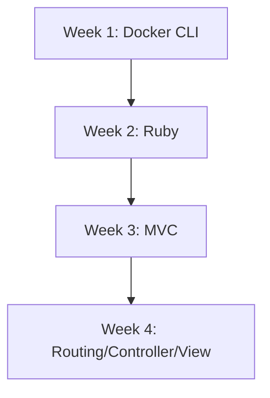

[](https://github.com/masa0917-private/rails-learning-cli-mac/actions/workflows/ci.yml)

# Rails (CLI + Docker Compose) 学習リポジトリ

このリポジトリのテーマは、**「目的：Ruby on Rails の学習と、学習のための環境構築」** です。
CLI 中心・Docker Compose による隔離環境を使い、Rails 公式ドキュメントを主教材として段階的に学習できるように設計しています。

主な目的
- Rails公式ドキュメントを主教材とした学習を行う
- ホスト環境を汚さない（Ruby/Rails/DBはコンテナ内へ）
- VS Code Dev Container に依存しない CLI-first ワークフロー

学習プラン（入口）

| フェーズ | 学習テーマ | まず読むドキュメント |
|---|---|---|
| 1 | 環境構築 | README.md / Specification.md |
| 2 | Ruby / Rails 基礎 | PLAN.md / Rails Guides |
| 3 | CRUD / MVC / Testing | PLAN.md / `blog/` |
| 4 | 発展（Hotwire / PostgreSQL） | PLAN.md / Specification.md |

ドキュメント構成

| ドキュメント | 役割 | 推奨タイミング |
|---|---|---|
| `README.md` | 全体像、学習テーマ、起動方法、復元方法の入口 | 最初に読む |
| `PLAN.md` | 学習プラン、進捗、次アクションの管理 | 学習開始前と節目ごと |
| `Specification.md` | 環境構築の正本、設計理由、構成の根拠 | 環境変更前・詳細確認時 |

Copilot 最適化

| ファイル | 役割 | 有効なツール |
|---|---|---|
| `.github/copilot-instructions.md` | リポジトリ全体の Copilot 指示（自動適用） | CLI / VS Code / GitHub.com |
| `AGENTS.md` | Rails 家庭教師ペルソナ（CLI 対応の主要指示） | CLI / クラウドエージェント |
| `.github/instructions/rails-tutorial.instructions.md` | `blog/` 配下の Rails 学習コード向け指示（対象ファイルで自動適用） | CLI / クラウドエージェント / コードレビュー |
| `.github/instructions/docs.instructions.md` | README / PLAN / Specification / Copilot 関連文書の整合指示 | CLI / クラウドエージェント / コードレビュー |
| `.github/agents/rails-tutor.agent.md` | Rails を教えるためのカスタム agent | **VS Code 専用**（`target: vscode`） |
| `.github/prompts/rails-tutorial.prompt.md` | Rails チュートリアル継続用の prompt file | **VS Code 専用** |

> 重要: **GitHub Copilot CLI を使う場合**、有効になるのは `copilot-instructions.md` / `AGENTS.md` / `.github/instructions/*.instructions.md` です。  
> `.github/agents/*.agent.md`（カスタム agent）と `.github/prompts/*.prompt.md`（prompt file）は **VS Code Copilot Chat 専用**で、CLI では読み込まれません。

この構成は、GitHub 公式の **repository instructions / agent instructions / path-specific instructions / prompt files / custom agents** の考え方に合わせています。  
使い分けは次の通りです。

- **CLI / VS Code 共通で自動適用**: `.github/copilot-instructions.md`
- **CLI で「Ruby on Rails の先生」ペルソナを効かせる**: `AGENTS.md`
- **Rails 学習コードや文書だけに絞る**: `.github/instructions/*.instructions.md`
- **VS Code で先生ペルソナを選ぶ**: `rails-tutor.agent.md`
- **VS Code で同じ学習プロンプトを再利用する**: `/rails-tutorial`

Prerequisites
- Docker Desktop（macOS/Windows/Linux）
- docker compose（Docker Desktop に同梱）
- サンプルアプリ `blog/`（Rails 7.1 / Ruby 3.3.11 / SQLite）は本リポジトリに同梱済み

リポジトリ構成（例）

```text
~/Documents/Rails/
  └── blog/
      ├── Dockerfile
      ├── Dockerfile.dev
      ├── compose.yaml
      ├── .dockerignore
      ├── Gemfile
      ├── Gemfile.lock
      ├── app/
      ├── bin/
      ├── config/
      ├── db/
      ├── storage/
      ├── test/
      └── tmp/
```

ER図サンプル（Step 5: 単一モデル CRUD）



進捗可視化（Mermaidフロー）



素早い開始（このリポジトリの blog/ を使う）

サンプルアプリ `blog/` は既に含まれています。以下はリポジトリのルートから実行します。

```bash
git clone https://github.com/masa0917-private/rails-learning-cli-mac.git
cd rails-learning-cli-mac
```

compose.yaml と Dockerfile.dev は `blog/` 配下に用意済みです（詳細は Specification.md を参照）。

compose の最小例（参考）

```yaml
services:
  web:
    build:
      context: .
      dockerfile: Dockerfile.dev
    command: ./bin/rails server -b 0.0.0.0 -p 3000
    ports:
      - "3000:3000"
    volumes:
      - .:/rails:delegated
    environment:
      RAILS_ENV: development
    stdin_open: true
    tty: true
```

ビルド・DB準備・起動（ルートから make を実行）

```bash
make build      # docker compose -f blog/compose.yaml build
make db-prepare # rails db:prepare を実行
make up         # docker compose up
```

Makefile の主なターゲット（すべて blog/compose.yaml を対象に動作）

- make build        : docker compose build
- make buildx       : buildx を用いたマルチアーキビルド（Apple Silicon 向け）
- make up           : docker compose up
- make up-detach    : docker compose up -d
- make down         : docker compose down
- make db-prepare   : rails db:prepare を実行
- make console      : rails console を起動
- make test         : rails test を実行
- make shell        : web コンテナで bash を起動
- make logs         : コンテナのログを表示
- make help         : ヘルプを表示

Apple Silicon (M1/M2) 注意点
- イメージが amd64 を前提にしている場合、`docker buildx` または Compose の `platform: linux/arm64` 指定が必要になることがある
- ネイティブ gem（nokogiri, sqlite3 等）は追加の dev パッケージが必要（Specification.md に詳細あり）
- Docker Desktop の推奨設定: CPUs 4+, Memory 8GB+, gRPC FUSE が利用可能なら検討

参照: Specification.md を必ず先に読み、手順に従ってください。

Specification（詳細仕様）:
- 詳細かつ公式準拠の手順、Dockerfile.dev、compose 例、ER図、Mermaid 図は Specification.md にまとめています。
- ローカルで開く: `less Specification.md` または `cat Specification.md`

---

(この README は Specification.md の要旨とサンプルを含みます。実運用では Specification.md が正本です。)

---

学習開始手順（このリポジトリを利用する場合）

サンプルアプリ `blog/`（Rails 7.1 / Ruby 3.3.11 / SQLite）は既にこのリポジトリに含まれています。新規に生成する必要はありません。

1. このリポジトリをクローンまたは最新に pull する
2. make build  (または make buildx)
3. make db-prepare
4. make up   → http://localhost:3000 を開く

補足: Makefile は `blog/compose.yaml` を対象に動作します（`docker compose -f blog/compose.yaml ...`）。リポジトリのルートから `make` を実行してください。

CI の期待値と解釈

- このリポジトリの CI は .github/workflows/ci.yml に定義されています。`blog/` を作業ディレクトリとして、Ruby 3.3.11 + SQLite でテストを実行します。
- サンプルアプリ `blog/` が含まれているため、CI は実際に `rails db:prepare` と `rails test` を実行します。
- CI バッジ（README 上部）で成功/失敗を確認してください。失敗時は Actions のランログを開き、最初に失敗したステップの標準出力を確認します。

Start here — Rails チュートリアルの開始点

- 公式チュートリアル（Getting Started）を最初に行ってください: https://guides.rubyonrails.org/getting_started.html
- 推奨フロー: Specification.md を読み、リポジトリ内の `blog/` を使ってローカルで手を動かしながら進めると良いです。
- 週次チェック: CI は週次で自動実行されます（Schedule: Sunday 00:00 UTC）。ローカル変更は push して CI をトリガーしてください。

クリーン基準点（チュートリアル開始前の復元用）

- チュートリアル開始前の最もクリーンな状態を Git タグ **`rails-learning-clean-baseline-2026-06-18`** として記録しています。
- 基準点の内容: SSH移行済み、PAT失効確認済み、CI green、Docker Desktop 復旧確認済み、Rails app が HTTP 200 を返す状態。
- 以後、学習中に状態を戻したくなった場合はこのタグを基準に復元できます。

復元コマンド（破壊的）

```bash
cd ~/Documents/Rails
git fetch --tags
git reset --hard rails-learning-clean-baseline-2026-06-18
docker compose -f blog/compose.yaml down -v
docker compose -f blog/compose.yaml up --build -d
docker compose -f blog/compose.yaml run --rm web ./bin/rails db:prepare
```

注意:
- `git reset --hard` は未コミット変更を破棄します。
- `docker compose ... down -v` はこの学習環境のコンテナ/volume を削除します。
- 私に **「clean baseline に戻して」** と指示すれば、このタグを基準に復元方針で対応します。

トラブルシュート（よくある問題）

- "Could not locate Gemfile": カレントディレクトリが app のルートであることを確認（docker compose run は blog 配下で実行）
- ネイティブ gem ビルドエラー: Dockerfile.dev に libxml2-dev, libxslt1-dev, zlib1g-dev, build-essential を追加して再ビルド
- Apple Silicon (M1/M2) のアーキ違い: make buildx を使う、または compose で platform: linux/arm64 を指定
- bind mount が遅い(macOS): volumes に ":delegated" を付ける、Docker Desktop の gRPC FUSE を検討

補足: Specification.md が正本です。README はクイックスタートと要点をまとめたものです。

参考: Specification.md を先に読み、手順に従ってください。