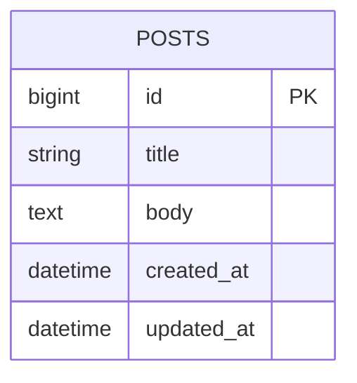
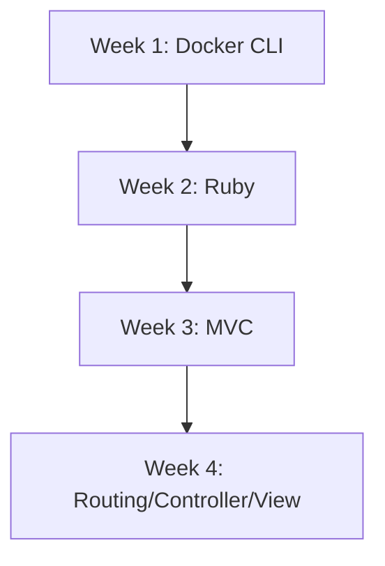

[](https://github.com/masa0917-private/rails-learning-cli-mac/actions/workflows/ci.yml)

# Rails (CLI + Docker Compose) 学習リポジトリ

このリポジトリは「CLI中心・Docker Composeで隔離されたRails学習環境」を目的としたテンプレート／仕様です。

主な目的
- Rails公式ドキュメントを主教材とした学習を行う
- ホスト環境を汚さない（Ruby/Rails/DBはコンテナ内へ）
- VS Code Dev Container に依存しない CLI-first ワークフロー

Prerequisites
- Docker Desktop（macOS/Windows/Linux）
- docker compose（Docker Desktop に同梱）
- `rails-new` で初期アプリを生成（例: `rails-new blog`）

リポジトリ構成（例）

```text
~/Documents/Rails/
  └── blog/
      ├── Dockerfile
      ├── Dockerfile.dev
      ├── compose.yaml
      ├── .dockerignore
      ├── Gemfile
      ├── Gemfile.lock
      ├── app/
      ├── bin/
      ├── config/
      ├── db/
      ├── storage/
      ├── test/
      └── tmp/
```

ER図サンプル（Step 5: 単一モデル CRUD）



進捗可視化（Mermaidフロー）



素早い開始（例）

1) 初期 app を生成

```bash
mkdir -p ~/Documents/Rails
cd ~/Documents/Rails
rails-new blog
cd blog
```

2) compose.yaml と Dockerfile.dev を用意（Specification.md を参照）

compose の最小例（README 用サンプル）

```yaml
services:
  web:
    build:
      context: .
      dockerfile: Dockerfile.dev
    command: ./bin/rails server -b 0.0.0.0 -p 3000
    ports:
      - "3000:3000"
    volumes:
      - .:/rails:delegated
    environment:
      RAILS_ENV: development
    stdin_open: true
    tty: true
```

3) ビルド・DB準備・起動

```bash
make build      # または: docker compose build
make db-prepare # rails db:prepare を実行
make up         # docker compose up
```

Makefile の主なターゲット

- make build        : docker compose build
- make buildx       : buildx を用いたマルチアーキビルド（Apple Silicon 向け）
- make up           : docker compose up
- make up-detach    : docker compose up -d
- make down         : docker compose down
- make db-prepare   : docker compose run --rm web ./bin/rails db:prepare
- make console      : docker compose run --rm web ./bin/rails console
- make test         : docker compose run --rm web ./bin/rails test
- make shell        : docker compose exec web bash
- make help         : ヘルプを表示

Apple Silicon (M1/M2) 注意点
- イメージが amd64 を前提にしている場合、`docker buildx` または Compose の `platform: linux/arm64` 指定が必要になることがある
- ネイティブ gem（nokogiri, sqlite3 等）は追加の dev パッケージが必要（Specification.md に詳細あり）
- Docker Desktop の推奨設定: CPUs 4+, Memory 8GB+, gRPC FUSE が利用可能なら検討

参照: Specification.md を必ず先に読み、手順に従ってください。

Specification（詳細仕様）:
- 詳細かつ公式準拠の手順、Dockerfile.dev、compose 例、ER図、Mermaid 図は Specification.md にまとめています。
- ローカルで開く: `less Specification.md` または `cat Specification.md`

---

(この README は Specification.md の要旨とサンプルを含みます。実運用では Specification.md が正本です。)

---

学習開始手順（このリポジトリを利用する場合）

1. このリポジトリをクローンまたは最新に pull する
2. ローカルで Rails アプリを生成する（コンテナ経由推奨）:
   docker run --rm -v "$PWD":/rails -w /rails ruby:3.3 bash -lc "gem install rails -v 7.1 --no-document && rails new blog --skip-bundle"
3. blog ディレクトリへ移動し、.ruby-version を確認（Specification.md と一致させる）
4. make build  (または make buildx)
5. make db-prepare
6. make up   → http://localhost:3000 を開く

CI の期待値と解釈

- このリポジトリの CI は .github/workflows/ci.yml に定義されています。Ruby バージョンのマトリクス(3.3.6/3.2.2)と DB マトリクス(sqlite/postgres)でテストを実行します。
- ワークフローは "Gemfile が無い場合は db:prepare/test をスキップ" する保護を備えています。つまり、サンプルアプリ（blog）をコミットすると初めて CI が実動します。
- CI バッジ（README 上部）で成功/失敗を確認してください。失敗時は Actions のランログを開き、最初に失敗したステップの標準出力を確認します。

トラブルシュート（よくある問題）

- "Could not locate Gemfile": カレントディレクトリが app のルートであることを確認（docker compose run は blog 配下で実行）
- ネイティブ gem ビルドエラー: Dockerfile.dev に libxml2-dev, libxslt1-dev, zlib1g-dev, build-essential を追加して再ビルド
- Apple Silicon (M1/M2) のアーキ違い: make buildx を使う、または compose で platform: linux/arm64 を指定
- bind mount が遅い(macOS): volumes に ":delegated" を付ける、Docker Desktop の gRPC FUSE を検討

補足: Specification.md が正本です。README はクイックスタートと要点をまとめたものです。

このリポジトリは「CLI中心・Docker Composeで隔離されたRails学習環境」を目的としたテンプレート／仕様です。

Prerequisites
- Docker Desktop（macOSの場合は Apple Silicon/Intel に対応）
- docker compose（Docker Desktop に同梱）
- `rails-new` で初期アプリを生成済み（例: `rails-new blog`）

素早い開始（Makefile を推奨）

# ビルド
make build

# 起動（フォアグラウンド）
make up

# 起動（デタッチ）
make up-detach

# DB準備
make db-prepare

# コンテナに入る
make shell

# テスト
make test

Apple Silicon (M1/M2) 注意
- 初回にマルチプラットフォームイメージが必要な場合は `make buildx` を使ってください。
- macOS では bind-mount の性能に注意。:delegated を使うと改善する場合があります。

参考: Specification.md を先に読み、手順に従ってください。