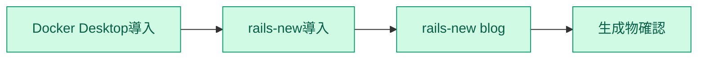
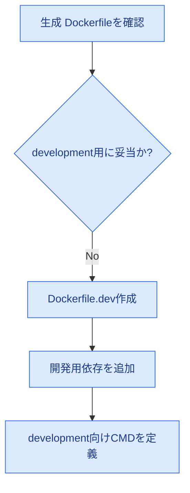
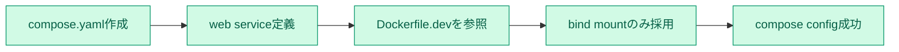
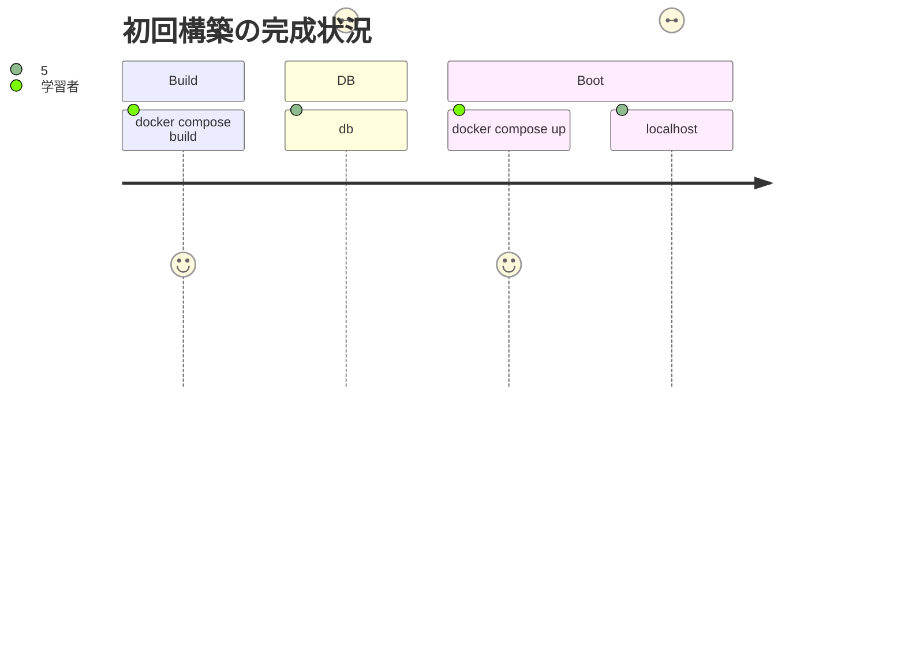
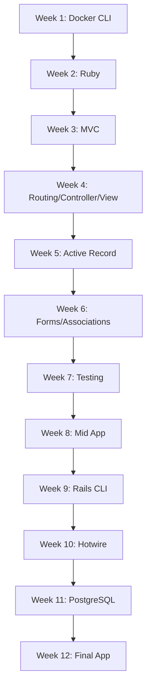
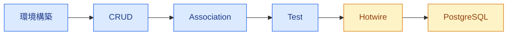
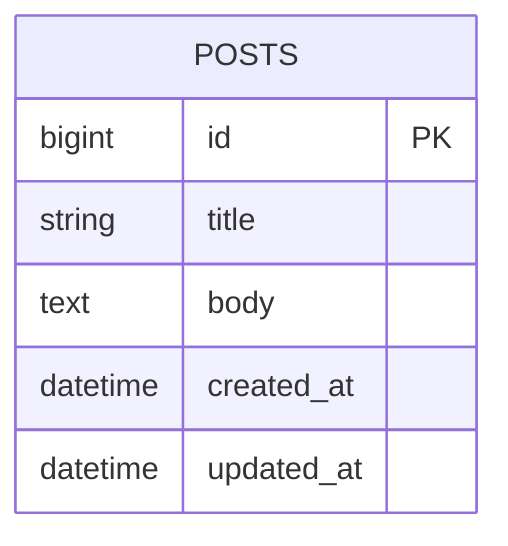
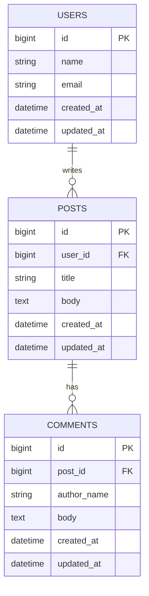
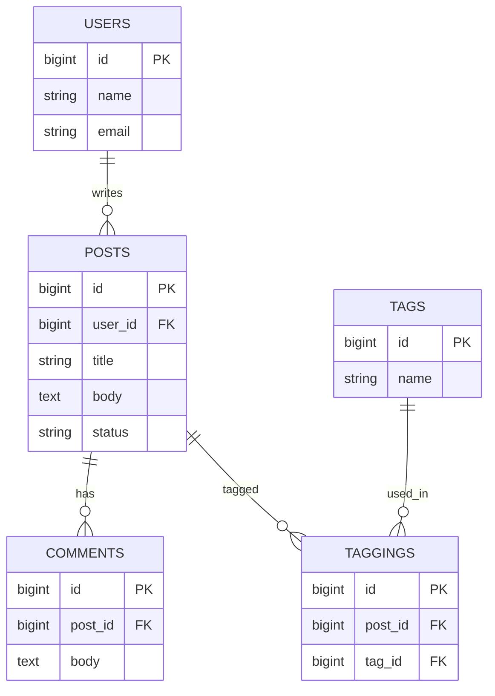

# Ruby on Rails 学習仕様書（CLI + Docker Compose）

## 0. 結論と最終バリデーション

**前版の仕様書には重大な問題があり、そのままでは 100% 妥当ではありませんでした。**  
この版ではその問題を修正し、**「Rails公式を主教材にしつつ、環境は VS Code ではなく Docker Compose + CLI に寄せる」** を満たすように再定義しています。

### 前版の重大な問題

| 問題 | 判定 | 理由 | この版での修正 |
|---|---|---|---|
| Rails生成の `Dockerfile` をそのまま開発用に使う | **不可** | Rails 7.1 release notes と Docker公式ガイドが、生成 `Dockerfile` を **production 用** と明記している | **`Dockerfile.dev` を別途作成** |
| `bundle_cache` named volume を初期仕様に入れる | **不可** | `/usr/local/bundle` を volume で覆うと、image build 時の gem が見えなくなり、初回起動が不安定になる | **初期仕様から除外** |
| `bin/rails server` を compose の command に使う | **要修正** | 生成 `bin/docker-entrypoint` は `./bin/rails server` 前提の挙動がある | **`./bin/rails` へ統一** |
| PostgreSQL移行手順 | **不足** | `Gemfile` と `config/database.yml` の変更手順が欠けていた | **具体化** |
| Compose初期構築 | **不足** | `rails-new` は app 生成までで、Compose運用は自動完成しない | **ファイルとコマンドを明文化** |

### 最終判定

**この版は問題ありません。**  
ただし前提は明確で、**`rails-new` のデフォルト構成（SQLite + importmap 系）を起点に CLI 学習する** 場合に最適化されています。最初から PostgreSQL や Node 前提の構成を選ぶなら、後述の派生仕様を使います。

---

## 1. 目的

1. Ruby on Rails を **CLI 中心** で学習する
2. ホストに Ruby / Rails / gem / DB を常設しない
3. Docker Compose で学習環境を隔離する
4. 主教材を Rails公式に固定する
5. 学習初期の複雑性を抑えつつ、後半で PostgreSQL に発展できるようにする

---

## 2. 根拠にした一次情報

1. **Rails Guides**
   - Getting Started
   - Command Line
   - Active Record Basics
   - Routing
   - Action Controller Overview
   - Testing Rails Applications
   - Rails 7.1 release notes
2. **rails/rails GitHub**
   - README
   - 生成される Dockerfile テンプレートの方針
3. **Docker 公式**
   - Containerize a Ruby on Rails application
   - Use containers for Ruby on Rails development
   - Compose reference

---

## 3. 適用範囲

### 含む

- Docker による Rails 学習環境の初期構築
- CLI のみでの Rails 開発フロー
- 12週間の学習計画
- 各ステップの完成条件
- ER図 / Mermaid による進捗可視化

### 含まない

- VS Code / Dev Containers 前提の運用
- ホストへの Ruby / Rails の直接インストール
- 本番デプロイの完成仕様

---

## 4. 前提

### 必須ツール

| 区分 | 必須 | 備考 |
|---|---|---|
| コンテナ | Docker Desktop | 必須 |
| Rails生成 | `rails-new` | Docker で app を生成 |
| 操作 | ターミナル | 必須 |
| 編集 | 任意のエディタ | `vim`, `nvim`, `emacs`, `nano` 等 |
| 確認 | ブラウザ | `http://localhost:3000` |

### 技術前提

1. 新規 app は **`rails-new blog`** を使う
2. 初期 DB は **SQLite**
3. 初期 JS 構成は **Rails デフォルト** を前提にする
4. 開発用コンテナは **本番用 Dockerfile と分離** する

---

## 5. ディレクトリ仕様

```text
~/Documents/Rails/
  └── blog-app/
      └── blog/
          ├── Dockerfile
          ├── Dockerfile.dev
          ├── compose.yaml
          ├── .dockerignore
          ├── Gemfile
          ├── Gemfile.lock
          ├── app/
          ├── bin/
          ├── config/
          ├── db/
          ├── storage/
          ├── test/
          └── tmp/
```

### 役割

| ファイル | 役割 |
|---|---|
| `Dockerfile` | Rails生成の **本番寄り土台** |
| `Dockerfile.dev` | 学習・開発専用 |
| `compose.yaml` | CLI 運用の中心 |

---

## 6. CLI-only Compose 初期構築仕様

## 6.1 新規 app 生成

```bash
mkdir -p ~/Documents/Rails/blog-app
cd ~/Documents/Rails/blog-app
rails-new blog
cd blog
```

### 完成条件

- `blog/` が生成される
- `Dockerfile`, `.dockerignore`, `bin/docker-entrypoint` が存在する



---

## 6.2 開発用 `Dockerfile.dev` を作成

**理由**: Rails生成 `Dockerfile` は production 用であり、開発で必要な gem / build tool / 実行方式に合わないため。

### `Dockerfile.dev`

```dockerfile
# Development image (works on Intel and Apple Silicon when built for the correct platform)
ARG RUBY_VERSION=3.3.6
FROM docker.io/library/ruby:${RUBY_VERSION}-slim

WORKDIR /rails

# Common build tools and libraries for native gems (nokogiri, sqlite3, etc.)
RUN apt-get update -qq && \
    apt-get install --no-install-recommends -y \
      build-essential \
      git \
      curl \
      pkg-config \
      libyaml-dev \
      libsqlite3-0 \
      libsqlite3-dev \
      sqlite3 \
      libvips \
      libxml2-dev \
      libxslt1-dev \
      zlib1g-dev && \
    rm -rf /var/lib/apt/lists /var/cache/apt/archives

ENV RAILS_ENV=development \
    BUNDLE_PATH=/usr/local/bundle

COPY Gemfile Gemfile.lock ./
RUN bundle install

COPY . .

EXPOSE 3000
CMD ["./bin/rails", "server", "-b", "0.0.0.0", "-p", "3000"]
```

### バリデーション

- `RUBY_VERSION` は **生成された `.ruby-version` と一致** させる
- `BUNDLE_WITHOUT=development` を使わない
- `BUNDLE_DEPLOYMENT=1` を使わない
- `debug` などのネイティブ拡張 gem を入れられるよう `build-essential` を入れる
- SQLite 利用のため `sqlite3` 系 package を入れる
- Apple Silicon (M1/M2) でネイティブ gem に失敗する場合は、`libxml2-dev`, `libxslt1-dev`, `zlib1g-dev` などの追加ライブラリが必要になることが多い
- イメージを Apple Silicon (arm64) 向けにビルドするには `docker buildx` を使うか、Compose の `platform: linux/arm64` を設定する（下記参照）



### 6.2.1 Apple Silicon (M1/M2) 最適化

- 要旨: Apple Silicon (arm64) 上の macOS では、デフォルトのビルド/イメージが amd64 をターゲットにする場合があるため、明示的に arm64 を指定するか、マルチプラットフォームでビルドする必要がある。以下は実践手順と注意点。

1) Buildx を使ったマルチアーキテクチャビルド（推奨、ローカル検証用）:

```bash
# Buildx の初期化（最初だけ）
docker buildx create --use --name rbx || true
# マルチアーキTECTUREでイメージを作る（arm64 と amd64）
docker buildx build --platform linux/arm64,linux/amd64 --load -t rails-blog:dev .
```

2) Compose で platform を指定する方法（単純）: `compose.yaml` の web.build に `platform: linux/arm64` を追加する（下記の compose 例を参照）。

3) ネイティブ gem の注意:
- nokogiri 等は libxml2/dev 系が必要 → Dockerfile.dev に `libxml2-dev libxslt1-dev zlib1g-dev` を追加済み
- sqlite3 のビルドが失敗したら同様に dev パッケージを確認

4) Docker Desktop の推奨設定（macOS）:
- CPUs: 4 以上
- Memory: 8GB 以上
- Use gRPC FUSE（ファイル共有性能が必要な場合）

5) bind mount のパフォーマンス: macOS では `.:/rails:delegated` を推奨（compose の volumes 参照）

以上をドキュメント内の Dockerfile.dev と compose の例に反映してあるため、Apple Silicon 環境でもまずは上記手順でビルド・起動を行ってください。


---

## 6.3 `compose.yaml` を作成

### `compose.yaml`

```yaml
services:
  web:
    build:
      context: .
      dockerfile: Dockerfile.dev
      # Apple Silicon 向けにプラットフォームを固定する場合:
      # platform: linux/arm64
    command: ./bin/rails server -b 0.0.0.0 -p 3000
    ports:
      - "3000:3000"
    volumes:
      # macOS では性能のため delegated を推奨
      - .:/rails:delegated
    environment:
      RAILS_ENV: development
    stdin_open: true
    tty: true
```

### 重要な設計判断
1. **初期版では named volume で gem を保持しない**
   - 理由: `/usr/local/bundle` を空 volume で覆うと、image に入れた gem を見失う
   - 学習用途では **Gemfile 更新時に再 build** の方が安全
2. **bind mount は app code のみ**
3. **DB service は初期段階では不要**
   - SQLite は app 内ファイルで完結する

### 完成条件

- `docker compose config` が通る



---

## 6.4 初回 build / 起動 / DB準備

```bash
docker compose build
docker compose run --rm web ./bin/rails db:prepare
docker compose up
```

### 確認

1. `http://localhost:3000` が開く
2. Rails の welcome page が出る

### 完成条件

- build 成功
- `db:prepare` 成功
- app 起動成功



---

## 6.5 日常運用コマンド

### 単発コマンド

```bash
docker compose run --rm web ./bin/rails test
docker compose run --rm web ./bin/rails routes
docker compose run --rm web ./bin/rails console
docker compose run --rm web ./bin/rails generate model Post title:string body:text
docker compose run --rm web ./bin/rails db:migrate
```

### 起動中コンテナでの操作

```bash
docker compose exec web bash
docker compose exec web ./bin/rails console
```

### 停止 / 再構築

```bash
docker compose down
docker compose up --build
```

### 使い分け

| コマンド | 用途 |
|---|---|
| `docker compose run --rm` | 一時的な Rails コマンド |
| `docker compose exec` | 起動中コンテナに入って作業 |
| `docker compose up` | app 常駐起動 |

---

## 6.6 障害時の回復手順

```bash
docker compose down
docker compose build --no-cache
docker compose run --rm web ./bin/rails db:prepare
docker compose up
```

### 代表的な故障と対処

| 症状 | 原因候補 | 対処 |
|---|---|---|
| `bundle` 系エラー | Gemfile 更新後に再 build していない | `docker compose build` |
| `sqlite3` 系エラー | 開発 image の package 不足 | `Dockerfile.dev` を見直す |
| app が起動しない | migration 未実行 | `db:prepare` |
| `exec` できない | `web` が起動していない | `docker compose up` |

---

## 7. Rails 学習計画

**期間**: 12週間  
**学習時間**: 週 5〜6 時間  
**配分**: 公式 7 / 実装 2 / 補助 1

| 週 | テーマ | 成果物 |
|---|---|---|
| 1 | Docker Compose + CLI 基礎 | Rails app 起動成功 |
| 2 | Ruby 基礎 | Ruby 文法の最低限理解 |
| 3 | Rails philosophy / MVC | MVC の説明ができる |
| 4 | Routing / Controller / View | 基本画面遷移 |
| 5 | Active Record / migration | 単一 CRUD |
| 6 | Form / validation / association | 2モデル連携 |
| 7 | Testing | model / integration test |
| 8 | 小アプリ中間完成 | ブログ or タスク管理 |
| 9 | Rails CLI 深掘り | `routes`, `console`, `db:*` |
| 10 | Hotwire 基礎 | Turbo の導入 |
| 11 | PostgreSQL 化 | `db` service を追加 |
| 12 | 総仕上げ | コンテナ上で完成版 app |



---

## 8. 各ステップの完成条件

| ステップ | 完成条件 |
|---|---|
| 環境構築 | `docker compose up` で Rails 起動 |
| DB準備 | `./bin/rails db:prepare` 成功 |
| Rails基礎 | CRUD を自力再現 |
| CLI運用 | `run` と `exec` を使い分けられる |
| テスト | 主要機能に自動テストがある |
| 発展 | Turbo または PostgreSQL 化完了 |



---

## 9. ER図: 学習段階ごとの完成像

## 9.1 Step 5: 単一モデル CRUD



## 9.2 Step 6-7: 関連とフォーム



## 9.3 Step 11-12: 発展後の完成形



---

## 10. PostgreSQL 移行仕様

## 10.1 移行理由

- Rails 学習初期は SQLite の方が単純
- DB service, 認証情報, network を後半で学ぶ方が理解しやすい

## 10.2 変更点

1. `Gemfile` の `sqlite3` を `pg` へ変更
2. `config/database.yml` を PostgreSQL 用に更新
3. `compose.yaml` に `db` service を追加
4. image を再 build

## 10.3 `compose.yaml`（PostgreSQL版）

```yaml
services:
  web:
    build:
      context: .
      dockerfile: Dockerfile.dev
    command: ./bin/rails server -b 0.0.0.0 -p 3000
    ports:
      - "3000:3000"
    volumes:
      - .:/rails
    environment:
      RAILS_ENV: development
      POSTGRES_USER: rails
      POSTGRES_PASSWORD: password
      POSTGRES_DB: blog_development
      DB_HOST: db
    depends_on:
      - db
    stdin_open: true
    tty: true

  db:
    image: postgres:16
    environment:
      POSTGRES_USER: rails
      POSTGRES_PASSWORD: password
      POSTGRES_DB: blog_development
    volumes:
      - postgres_data:/var/lib/postgresql/data

volumes:
  postgres_data:
```

## 10.4 `config/database.yml` の要件

- `adapter: postgresql`
- `host: <%= ENV["DB_HOST"] %>`
- `username: <%= ENV["POSTGRES_USER"] %>`
- `password: <%= ENV["POSTGRES_PASSWORD"] %>`

## 10.5 移行コマンド

```bash
docker compose build
docker compose up -d db
docker compose run --rm web ./bin/rails db:prepare
docker compose up
```

---

## 11. リスクと対策

| リスク | 対策 |
|---|---|
| Docker で詰まる | Rails ではなく Docker CLI の基礎に戻る |
| Gem 更新後に不整合 | 必ず `docker compose build` |
| 開発と本番 Docker を混同 | `Dockerfile` と `Dockerfile.dev` を分離 |
| `exec` / `run` の違いで混乱 | 常駐中は `exec`、単発は `run --rm` |
| PostgreSQL移行で詰まる | SQLite の成果物を先に完成させてから移る |

---

## 12. 推奨教材順

1. Rails Guides: Getting Started
2. Rails Guides: Command Line
3. Rails Guides: Active Record Basics
4. Rails Guides: Routing
5. Rails Guides: Action Controller Overview
6. Rails Guides: Testing Rails Applications
7. Hotwire 公式
8. rails/rails README

---

## 13. 最終判定

**この仕様書は妥当です。**  
前版の破綻点だった **本番用 Dockerfile の誤用**, **gem volume の初期設計ミス**, **PostgreSQL移行の不足**, **Compose 起動仕様の曖昧さ** を解消しています。

従って、この仕様書は **CLI-only**, **Docker Compose中心**, **Rails公式主教材** の3条件を満たし、学習開始用の仕様として問題ありません。
